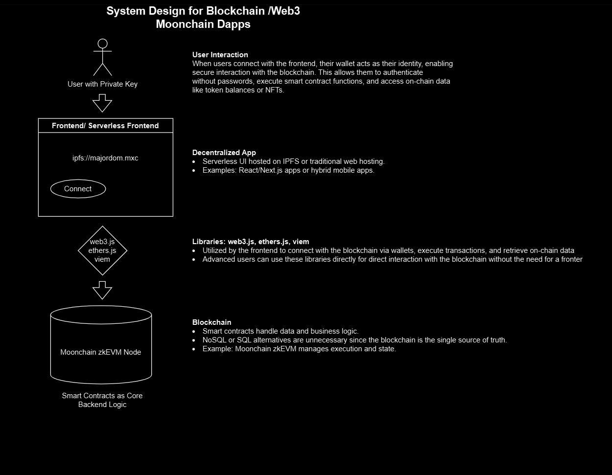

# The Dapp Design Primer
## Motivation
### Learn how to design large-scale systems in Web2 and Web3

System design is a broad field. There is a huge amount of resources scattered around the internet on the principles of system design. **This repository is intended to be a collection of the various aspects that are relevant to both traditional system architecture (web2) and decentralized system architecture (web3)**, but also how the former can be simplified through the use of blockchain technology. To this end, the web3 area of the repository is being continuously expanded.

In the Web2 paradigm, building an application involves a multi-layered architecture, often requiring centralized servers, databases, load balancers, and authentication systems. This design process, while robust, comes with significant overhead in terms of infrastructure, scalability, and security challenges.

On the other hand, Web3 offers a paradigm shift by decentralizing these components. By leveraging blockchain technology, decentralized storage, and user-controlled wallets, Web3 eliminates the need for many traditional intermediaries. This can simplify the process of delivering applications while providing enhanced transparency, security, and user ownership.

Learning how to design scalable systems will help you become a better engineer.

## Important parts for setting up a decentralized application (dApp)

  
   

## Thoughts when it comes to building a Web3 decentralized application
### Step 1: Outline use cases, constraints, and assumptions

* Define the requirements and scope for your Web3 application. While some aspects overlap with Web2, Web3 introduces decentralized elements that must be considered. Ask specific questions to clarify use cases and constraints:

    * Who are the users, and what value does decentralization bring to them?
    * How will the application leverage blockchain and decentralization?
    * Which blockchain or layer-2 solution will be used?
    * What types of interactions will occur with smart contracts?
    * What are the gas cost implications for these interactions?
    * How will users authenticate (e.g., wallet-based or account abstraction)?
    * What data will be stored on-chain versus off-chain?
    * How will scalability and latency requirements be met?

### Step 2: Create a high-level design

* Outline a high-level design for your Web3 application, focusing on decentralized components and how they interact with users and the blockchain.

    * Key components to sketch:
        * Frontend: Hosted on decentralized storage (e.g., IPFS, Arweave) or via serverless deployment.
        * Smart Contracts: Define core logic and operations, deployed on the blockchain.
        * Off-Chain Data: Consider indexing solutions like The Graph for querying blockchain data efficiently.
        * Wallet Integration: Plan for user interaction with wallets (e.g., MetaMask, WalletConnect).
    * Justify your choices:
        * Why this blockchain? (e.g., EVM compatibility, transaction costs)
        * Why this storage solution? (e.g., decentralized or hybrid storage)

### Step 3: Design core components

* Dive deeper into the decentralized and hybrid components of your Web3 application:

    * Smart Contracts:
        * Define business logic and immutable state.
        * Ensure gas-efficient design for transactions.
        * Follow standards (e.g., ERC-20, ERC-721, ERC-4337) if applicable.
        * Conduct thorough audits for security.

    * Frontend:
        * Design a user-friendly, Web3-aware interface.
        * Integrate wallet support for authentication and transactions.
        * Optimize for decentralized deployment (e.g., serverless, IPFS).

    * Off-Chain Data and Indexing:
        * Use tools like The Graph for efficient querying of blockchain data.
        * Implement off-chain storage for large or frequently updated datasets.

    * Interaction Flow:
        * Ensure seamless user interaction with smart contracts (e.g., transaction signing).
        * Consider fallback options for users with limited blockchain experience.

### Step 4: Scale the design

* Address potential scalability issues in your Web3 application, focusing on the blockchain and decentralized architecture:

    * Blockchain Scalability:
        * Choose a blockchain with high TPS or use a layer-2 solution like Arbitrum or Optimism.
        * Optimize smart contracts to reduce gas usage.

    * User Onboarding and Experience:
        * Implement account abstraction to simplify wallet management.
        * Provide clear UI/UX for transaction statuses and gas fee management.

    * Data Scaling:
        * Use decentralized or hybrid solutions like IPFS and cloud storage for off-chain data.
        * Cache frequently accessed data locally or via distributed networks.

    * Frontend Performance:
        * Employ decentralized CDNs or peer-to-peer networks for low-latency access.

## Important parts for setting up a Web2 application

  
   

## Thoughts when it comes to building a web2 application
### Step 1: Outline use cases, constraints, and assumptions

Gather requirements and scope the problem.  Ask questions to clarify use cases and constraints.  Discuss assumptions.

* Who is going to use it?
* How are they going to use it?
* How many users are there?
* What does the system do?
* What are the inputs and outputs of the system?
* How much data do we expect to handle?
* How many requests per second do we expect?
* What is the expected read to write ratio?

### Step 2: Create a high level design

Outline a high level design with all important components.

* Sketch the main components and connections
* Justify your ideas

### Step 3: Design core components

* Generating and storing a hash of the full url
    * [MD5](solutions/system_design/pastebin/README.md) and [Base62](solutions/system_design/pastebin/README.md)
    * Hash collisions
    * SQL or NoSQL
    * Database schema
* Translating a hashed url to the full url
    * Database lookup
* API and object-oriented design

### Step 4: Scale the design

Identify and address bottlenecks, given the constraints.  For example, do you need the following to address scalability issues?

* Load balancer
* Horizontal scaling
* Caching
* Database sharding

## Resources related to Web2-based system architecture
[Web2 Resources](Web2.md)

## Credits

Credits and sources are provided throughout this repo.

Special thanks to:

* [System Design Primer](https://github.com/donnemartin/system-design-primer)

